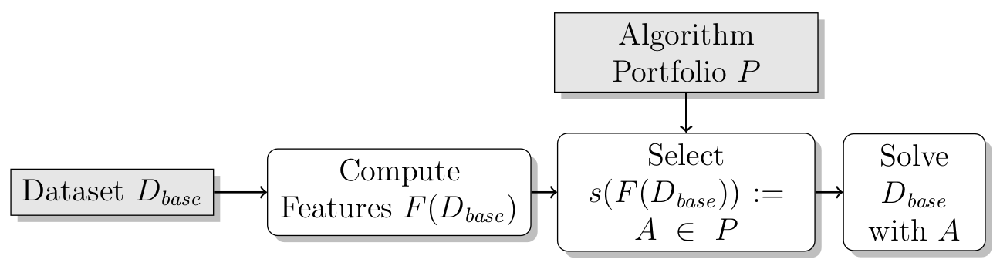

# Algorithm Selection

In this assignment, we will implement algorithm selection model for Machine Learning
algorithms. 
Formally, the task is to select the best algorithm *A* from a portfolio of
algorithms *P* for a given dataset *x* with respect to a performance
metric *m* (in this case: accuracy). 

The figure above shows a basic algorithm selection framework that is used in practice.
A basic approach involves
* representing a given dataset *x* with a vector of numerical features *F(x)* (the so-called meta-features, e.g., number of observations, number of features),
* inducing a meta-learning model $s$ that selects a (base-)model for the given dataset *x* based on its features *F(x)*.

Generally, these meta-learning models are induced based on a meta-dataset
*D = {(x_i, y_i) | i = 1, ..., n}* with *n* datapoints to map an
input *x* to output *f(x)*, which closely represents *y*.
In this setting, *x_i* is typically the vector of numerical features *F(x)*
from some base-dataset *x* that has been observed before.
There are various variations for representing the *y* values and ways for
algorithm selection system *s* to leverage the predictions *f(x)* (not to be confused with *F(x)*).

In this assignment, we will implement two methods for algorithm selection:

* **Baseline:** determines which of the base-models performs best on average on all base-datasets in the train set. This base-model is then applied on all  base-datasets in the test set.
* **Regression:** this models the performance of individual algorithms in the portfolio.
	A regression model *f_A* can be trained for each *A \in P*
	on $D$ with *x_j = \feat(\inst)* and *y_j = m(A, x)* for each
	previously observed dataset $i$ that $A$ was ran on.
	The machine learning algorithm can then predict how well algorithm $A$
	performs on a given dataset $x$.
	The algorithm with the best predicted performance is selected for solving
  the dataset.
\end{description}

For this assignment, we will try to predict for several (order of 70) datasets
which algorithm will perform best. 
For each dataset *D* the numerical vector
of meta-features *F(x)* will be provided (i.e., `Majority Class Size`, `Max Nominal Att Distinct Values`, `Minority Class Size`,
`Number Of Classes`, `Number Of Features`, `Number Of Instances`,
`Number Of Instances With Missing Values`, `Number Of Missing Values`, `Number Of Numeric Features`,
`Number Of Symbolic Features`). 

We will predict for a set of 10 classifiers (*|P| = 10*), which one will be most appropriate for a dataset: 
`AdaBoostClassifier(DecisionTreeClassifier)`,
`BernoulliNB`,
`DecisionTreeClassifier`,
`ExtraTreesClassifier`,
`GradientBoostingClassifier`,
`KNeighborsClassifier`,
`MLPClassifier`,
`RandomForestClassifier`,
`SGDClassifier`,
`SVC`. 

This assignment consists of the following files:
* metadata.csv
* test.py
* assignment.py

In the assignment file, fill in the code for the following functions:
* MetaLearningBestOnAverage: fit and predict
* MetaLearningRegressionBased: fit and predict

